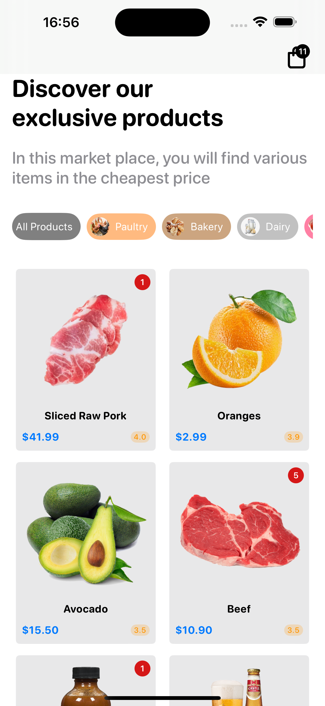
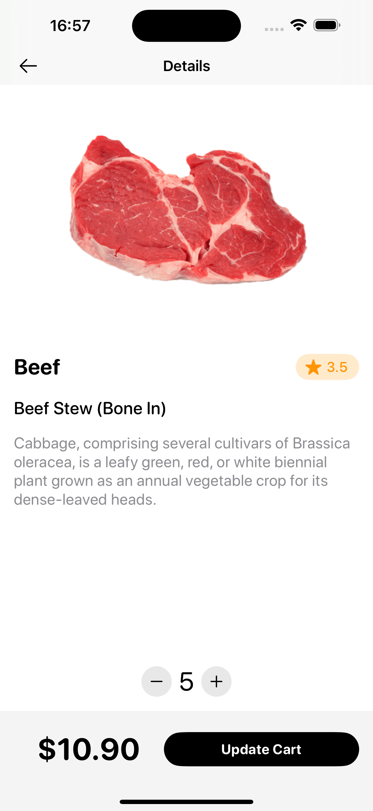
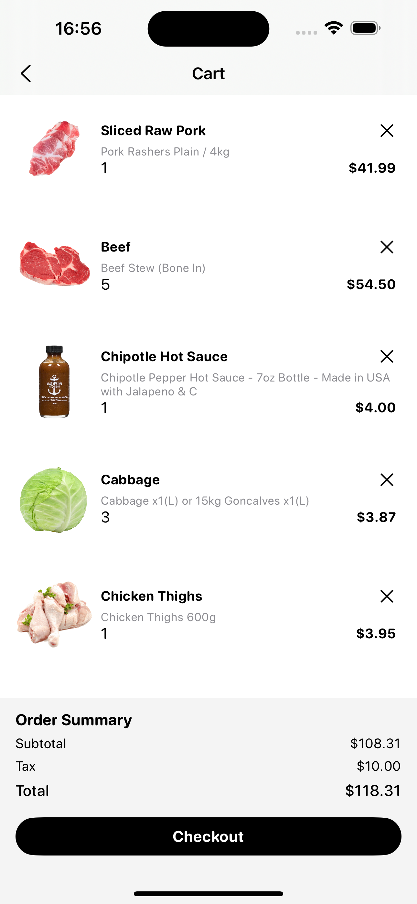
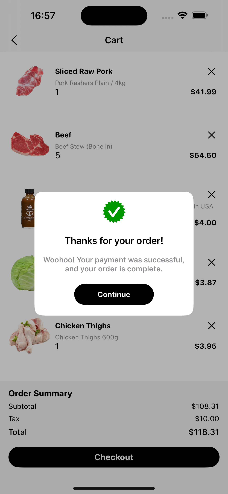

# Shopping Cart (SwiftUI/CoreData/iOS)

A simple shopping iOS app utilising CoreData and MVVM Architecture

### Screen Shots

| home    | Detail | Cart | Checkout |
| -------- | ------- | ------ | ------- |
|  |  |  |  |

