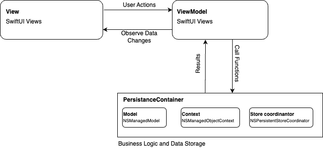

# Shopping Cart (SwiftUI/CoreData/iOS)

A simple shopping iOS app utilising CoreData and MVVM Architecture  

### Screen Shots
| home    | Detail | Cart | Checkout |
| -------- | ------- | ------ | ------- |
|  |  |  |  |
 
  
### Architecture Diagram
